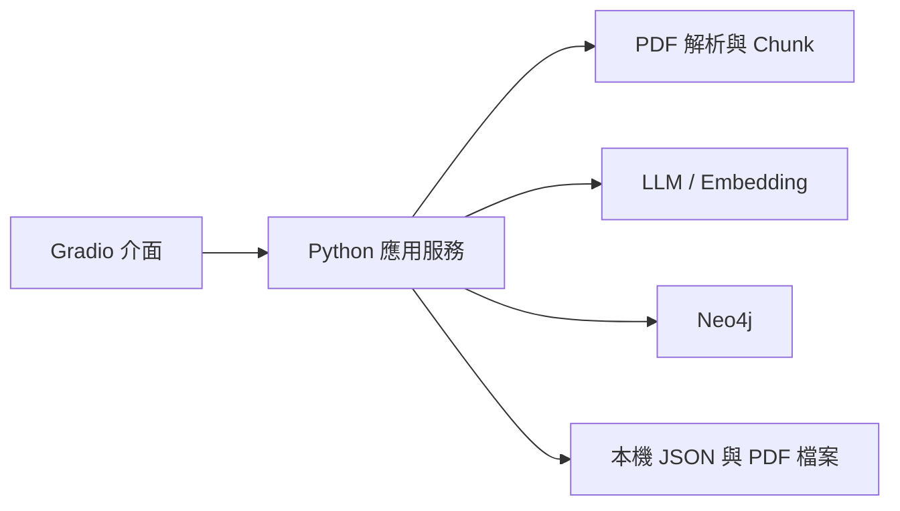

# 開發計畫：PDF GraphRAG 測試工具

## 1. 開發目標

依 [專案需求.md](專案需求.md) 實作本機 Gradio 工具，完成 PDF 解析、參數化建圖、Neo4j 儲存、GraphRAG 提問與結果比較。預估由一位 Python 工程師於 5 週完成 MVP。

## 2. 技術架構



| 項目 | 技術 |
|---|---|
| 介面 | Gradio Blocks |
| 應用程式 | Python、Pydantic |
| PDF 解析 | PyMuPDF；逐頁擷取排序後的純文字，排除頁面上下各 8% 的頁首頁尾區域，目前停用 OCR |
| 圖譜與檢索 | Neo4j Python driver、neo4j-graphrag |
| 資料保存 | JSON、原始 PDF 與處理快取 |
| 測試 | pytest、Neo4j 整合測試、Gradio 操作測試 |

## 3. 模組規劃

```text
gradio-pdf-graphrag/
├── src/
│   ├── app.py          # Gradio 啟動入口
│   └── manual_graphrag/
│       ├── ui.py       # 畫面與事件
│       ├── config.py   # 參數模型與預設值
│       ├── chunking.py # chunk 切分
│       ├── pdf_service.py
│       └── storage.py  # JSON 與檔案讀寫
├── tests/              # 單元及整合測試
├── data/               # 執行資料，不納入版本控制
└── README.md           # 安裝、啟動與操作說明
```

## 4. 核心實作

### PDF 與建圖

1. 驗證並保存 PDF，記錄檔案 hash 與頁碼。
2. 讀取 PDF 總頁數，將結束頁預設為最後一頁；驗證使用者指定的起訖頁碼，只解析所選範圍並標示空白或疑似掃描頁。
3. 依固定字元長度與 overlap 切分 chunk，保留來源頁碼，並提供建圖前預覽。
4. 使用抽取 LLM 取樣 chunks 規劃實體與關係 schema，讓使用者編輯確認後，再分批處理全部 chunks 並顯示帶來源的抽取結果。
5. 使用選定 LLM 抽取實體與關係，保留來源 chunk。
6. 使用選定 embedding 建立向量。
7. 將文件、chunk、實體、關係與來源寫入 Neo4j。
8. 建立向量及全文索引，驗證完成後將 run 標為 `ready`。

每次建圖建立獨立 `run_id`。修改 PDF、chunk、embedding、schema 或建圖 LLM 時建立新 run，避免覆寫既有實驗。

### GraphRAG 問答

1. 選擇一個 `ready` run。
2. 使用該 run 的 embedding 執行向量或混合檢索。
3. GraphRAG 模式從命中節點擴展相關實體與關係。
4. 將證據交給問答 LLM 生成答案。
5. 驗證引用並顯示 PDF 檔名、頁碼、來源文字及耗時。
6. 保存問題、參數、答案與檢索結果，供後續比較。

### JSON 儲存

```text
data/
├── documents/index.json
├── presets/{preset_id}.json
└── runs/{run_id}/
    ├── manifest.json
    ├── checkpoint.json
    └── queries/{result_id}.json
```

所有 JSON 包含 `schema_version`，以暫存檔加原子替換方式寫入。連線、模型、Password 與 API key 保存在已排除版本控制的 `.env`；啟動時讀取，介面欄位修改時自動原子寫入，也可手動重新載入。機密值不寫入實驗 JSON。

## 5. 開發排程

| 階段 | 時間 | 交付內容 |
|---|---|---|
| 1. 技術驗證 | 第 1 週 | 確認 Neo4j、模型與 PDF 解析；打通一份 PDF 建圖及提問 |
| 2. Gradio 與參數 | 第 2 週 | 完成連線、上傳、參數設定及 chunk 預覽介面 |
| 3. 建圖流程 | 第 3 週 | 完成 run、進度、抽取、embedding、Neo4j 索引與重試 |
| 4. 問答與比較 | 第 4 週 | 完成向量 RAG、GraphRAG、引用、紀錄與結果比較 |
| 5. 測試與交付 | 第 5 週 | 修正問題，完成整體測試、啟動文件與資料備份說明 |

## 6. 測試與驗收

- 參數驗證：頁碼、chunk、token、模型能力與連線錯誤。
- PDF 測試：中文、英文、跨頁 chunk、空白頁及損毀檔案。
- 建圖測試：來源追溯、重試不重複寫入、不同 run 互相隔離。
- 問答測試：只查詢選定 run、引用頁碼正確、無證據時拒答。
- JSON 測試：原子寫入、重啟讀取、schema 驗證及機密資料排除。
- 完整流程：上傳 → 預覽 → 建圖 → 提問 → 比較 → 重啟 → 刪除。

準備 5–10 份有權使用的中英文 PDF 與至少 30 題測試題。初始目標為答案正確率至少 80%、引用頁碼正確率至少 95%，並比較向量 RAG 與 GraphRAG 的答案、證據及耗時。

## 7. 重要限制

- Gradio 預設綁定 `127.0.0.1` 並停用公開分享。
- MVP 同時只執行一個建圖工作，不支援多程序寫入同一資料目錄。
- 掃描 PDF 只顯示無法解析提示；OCR 留待後續版本。
- LLM 不得執行任意 Cypher，資料庫操作使用受控查詢。
- 未完成或失敗的 run 不可用於問答。
- `neo4j-graphrag` 的實驗性功能須包裝在 adapter 中並鎖定版本。

## 8. 交付成果

- 可執行的 Gradio 應用程式。
- PDF 建圖與 GraphRAG 問答功能。
- JSON 設定及實驗紀錄。
- 自動化測試與測試結果。
- 安裝、啟動、操作、備份及限制說明。
